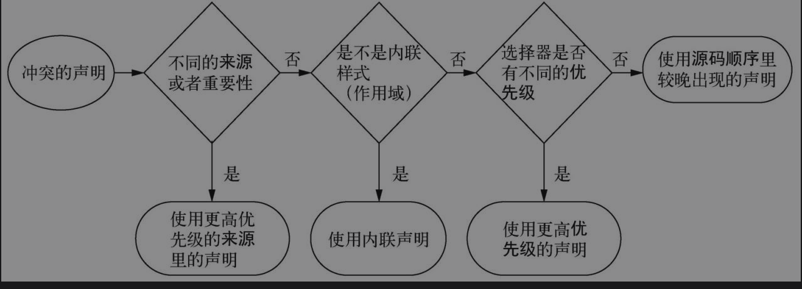
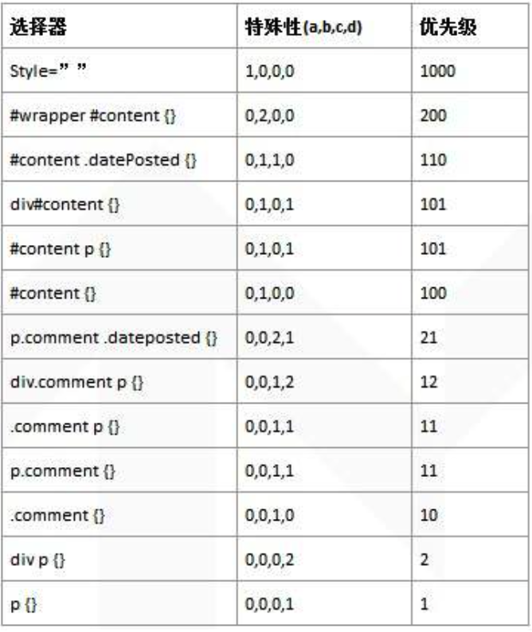
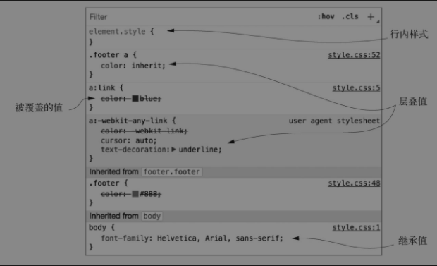

# 层叠与继承


## 层叠

### 什么是层叠？

- CSS 里的 C（代表 cascade，[层叠](https://developer.mozilla.org/zh-CN/docs/Web/CSS/Cascade))。

- 层叠的本质是一系列规则作用在一个元素上，浏览器决定了如何解决冲突。即在各种条件下，产生特定的效果 , 是 CSS 语言的基础。

**实例**

```html
<div id="text" class="page-text">Test</div>
```

```css
div {
  color: red;
}
#text {
  color: pink;
}
.page-text {
  color: black;
}
```

三个规则集尝试给`div`设置不同的字体颜色，哪一个会生效呢？

浏览器为了解决这个问题会遵循一系列规则，因此最终的效果可以预测。ID 选择器最终生效。

### 浏览器解决层叠的依据

 **当声明冲突时，层叠会依据如下三种条件解决冲突：**

1. 样式表的来源：样式是从哪里来的，包括作者样式和用户代理样式等。

2. 选择器优先级：哪些选择器比另一些选择器更重要。

3. 源码顺序：样式在样式表里的声明顺序。




### 样式表来源


####  用户代理样式

- 用户代理样式是指浏览器默认的样式。

- 不同浏览器上稍有差异，但是大体上是在做相同的事情：为标题（`<h1>`到`<h6>`）和段落（`<p>`）添加上下外边距，为列表（`<ol>`和`<ul>`）添加左侧内边距，为链接添加颜色，为元素设置各种默认字号。

####  作者样式

- `HTML`里面链接了多个样式表。

- 浏览器应用了用户代理样式后才会应用你的样式表，即作者样式表。

总结

- 可以看出作者的样式的优先级高于用户代理样式。

- 在实际项目中，大多都是覆盖用户代理的样式，这也是一种层叠的体现。

###  important

```css
color: red !important;
```

标记了`！important`的声明会被当作更高优先级的来源，因此总体的优先级按照由高到低排列如下所示：

1. 作者的`！important`。

2. 作者。

3. 用户代理。


### 优先级

如果无法样式表来源解决冲突声明，浏览器会尝试检查它们的优先级。

**浏览器将优先级分为两部分：**

-  HTML的行内样式。

-  选择器的样式。

#### 行内样式

```html
<div style="color:red">Test</div>
```

- 声明只会作用于当前元素。

- 在样式表里覆盖行内声明，需要为声明添加`！important`，这样能将它提升到一个更高优先级的来源。

- 但如果行内样式也被标记为`！important`，就无法覆盖它了。

- 最好是只在样式表内用`！important`, 将以上修改撤销。

#### 选择器优先级

每一种`css`选择器都有一种



### 源码顺序

层叠的第三步，也是最后一步，是源码顺序。如果两个声明的来源和优先级相同，
其中一个声明在样式表中出现较晚，或者位于页面较晚引入的样式表中，则该声明胜出。

## 继承

- 继承也是增加样式的一种。

- 继承是是顺着`DOM`树向下传递的。

- 继承的好处给祖先元素设置`css`属性,通过继承，所有的子元素都会继承这个属性，就不必给页面的每个元素明确该属性了。例如给
    `<body>`元素加上`font-family`,所有的子元素都会有这个字体。


### CSS属性分类

- [继承属性](https://developer.mozilla.org/zh-CN/docs/Web/CSS/inheritance)

  -  文本相关的属性。
  -  列表属性。
  -  表格的边框属性。

- [非继承属性](https://developer.mozilla.org/zh-CN/docs/Web/CSS/inheritance)

### 如何区分继承属性和非继承属性

通过 CSS 属性定义继承的`Inherited: Yes`,不继承的`Inherited: no`来查看。


### 浏览器开发者工具查看




### inherit

- 当希望从父元素上继承改属性值的时候，使用[inherit](https://developer.mozilla.org/zh-CN/docs/Web/CSS/inherit)。

- 可以作用于任何一个属性上。

```css
position : inherit;
```

### initial

- 每一个`CSS`属性都有初始（默认）值, 当需要撤销某个样式时可以使用[initial](https://developer.mozilla.org/zh-CN/docs/Web/CSS/initial)。

- 可以作用于任何一个属性上。

```css
position : initial;
```

常见一些属性的初始值：

-  position : static

-  display : inline

- width : auto

- height: auto

- box-sizing: content-box;

## 参考

- [深入解析CSS(图灵出品)](https://item.jd.com/12642199.html)

- [精通CSS 高级Web标准解决方案 第3版(图灵出品)](https://item.jd.com/12550434.html)