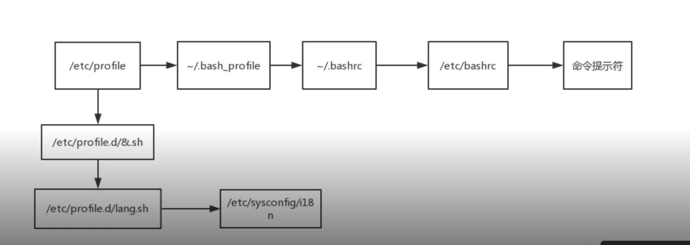

# 环境变量配置文件

## source
- 修改后的配置文件，必须注销重新登录才能生效。使用`source`命令可以不用重新登录。
- `source filepath` 或 `. filepath`

## 环境变量配置文件介绍
- `PATH` `HISTSIZE` `PS1` `HOSTNAME`等环境变量写入对应的环境变量文件。
- 环境变量配置文件中主要是定义系统操作环境生效的系统默认环境变量。 如`PATH`, 此文件登录时起作用的环境变量。

|  路径 | 说明 | 
|  ---  | --- |  
| /etc/profile  | |  
| /etc/profile.d/*.sh | |  
| /etc/bashrc | |  
| ~/.bash_profile | 只会对当前用户生效。 |  
| ~/.bashrc | 只会对当前用户生效。 |  

## 环境变量加载流程

1.   加载`/etc/profile`配置。
2.   加载`/ect/profile.d/`下面的所有脚本。
3.   加载当前用户 `~/.bash_profile`。
4.   加载`~/.bashrc`
5.   加载`/etc/bashrc`。



## 环境变量配置文件的作用

### `/etc/profile`
用来修改系统环境变量。

```sh
[root@iZm5eeens8iab3xz6f0rfiZ ~]# cat /etc/profile | grep USER
    USER="`/usr/bin/id -un`"
    LOGNAME=$USER
    MAIL="/var/spool/mail/$USER"
export PATH USER LOGNAME MAIL HOSTNAME HISTSIZE HISTCONTROL  #导出环境变量
```

|  变量 | 说明 | 
| --------- | --- |  
| USER     | 用户名|  
| LOGNAME  | 登录名|  
| MAIL     | 邮箱地址|  
| PATH     | 查找路径 |  
| HOSTNAME | 主机名|  


### `~/.bash_profile`

- `PATH`在这里修改`PATH`路径。
- 调用`~/.bashrc`。

### `~/.bashrc`
- 配置`alias`, 修改别名在这里。
- 调用`/etc/bashrc`。

### `/etc/bashrc`

- `PS1`登录提示符在这里修改。
- umash。
- `PATH`变量。
- 调用`/etc/profile.d/*.sh`文件。

## 其他配置文件

### 注销时生效的的环境变量配置文件

- `~/.bash_logout`

### 历史脚本

- 当正确退出计算机的时候会把历史记录写入文件`~/.bash_history`

## Shell 登录信息

- 本地终端欢迎信息`/etc/issue`
- 远程终端欢迎信息`/etc/issue.net`
- 不管远程还是本地都可以生效`/etc/motd`

```sh
[root@iZm5eeens8iab3xz6f0rfiZ ~]# cat /etc/issue.net
\S
Kernel \r on an \m
```
|  参数 | 说明 | 
| --------- | --- |  
| \d     | 当前系统日期|  
| \s     | 显示操作系统名称|  
| \l     | 显示登录的终端号|  
| \m     | 显示硬件体系结构，如`!368`等 |  
| \n     | 显示主机名|  
| \o     | 显示域名|  
| \r     | 显示内核版本|  
| \t     | 显示当前系统时间|  
| \u     | 显示当前登录用户的序列号|  