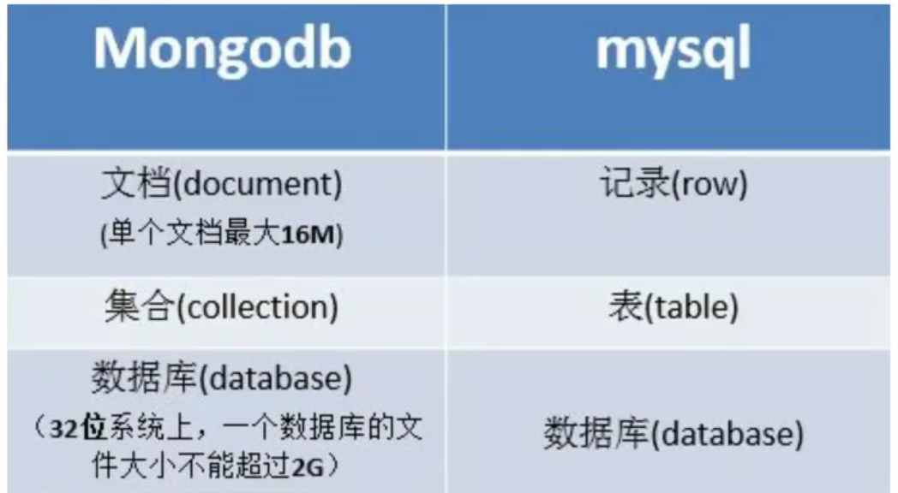

# MongoDB

## 什么是MongoDB

* `MongoDB`是一个基于分布式文件存储的开源数据库。

* `MongoDB`将数据存储为一个文档，数据结构键值(key和value)对组成。`MongoDB`文档类似于`JSON`对象。字段值可以使包含其他文档、数组及文档数据。

## MongoDB 安装

[各平台安装地址](https://docs.mongodb.com/manual/administration/install-community/)

## 启动与连接

1. 找到`MongoDB`安装目录，一般是`C:\Program Files\MongoDB 2.6 Standard\bin`。
2. 按下`Shift` + 鼠标右键，选择在此处打开命令窗口。
3. 在除`C`盘外的盘符新建一个空目录，如`D:\Mongodb\data`。
4. 在命令行输入`mongo --dbpath=D:\Mongodb\data`。

``` sh
mongod --dbpath=D:\Mongodb\data
```

5. 在按回车。

::: warning

* 如果出现 `waiting for connecttions on port 27017`, 就表示启动成功了，已经在27017端口上监听了客户端的请求。

* `--dbpath` 后的值表示数据库文件的存储路径，而且后面的路径必须事先创建好，必须已经存在，否则开启服务失败。

* 这个命令窗体绝对不能关，关闭这个窗口就相当于停止了`mongdb`服务。

:::

## MongoDB 基本概念

* `数据库 MongoDB`的单个实例可以容纳多个独立的数据库，比如一个学生管理系统就可以对应一个数据库实例。

* `集合` 数据库是由集合组成的，一个集合用来表示一个实体，如学生集合。

* `文档` 集合是由文档组成，一个文档表示一条记录，比如一位同学张三就是一个文档。



## 数据库操作

### 使用数据库

#### 语法

``` sh
use databane_name
```

* `databane_name` 代表数据库的名字。

* 如果此数据库存在，则切换到此数据库下，如果此数据库不存在也可以切过来，

但是并不能立刻创建数据库。只有插入数据了才会创建。

``` sh
use school
```

### 查看所有数据库

``` sh
show dbs 
```

::: warning
新建的数据库 `school` 如果不在列表里面，要显示它，我们需要 `school` 数据库插入一些数据。
:::

### 查看当前使用的数据库

``` sh
db 
```

* `db`代表的是当前数据库，也就是`school`这个数据库。

### 删除数据库

``` sh
db.dropDatabase()
```

## 集合操作

### 查看集合帮助

``` sh
db.test.help()
```

### 查看数据库下的集合

``` sh
show collections
```

### 创建集合

``` sh
# 选择数据库
use test
# 创建集合
db.creareCollection('集合名称','参数选项')
```

## 插入文档

### inser

* 向集合中插入文档。

* 若插入的数据主键已经存在，则会抛 `org.springframework.dao.DuplicateKeyException` 异常，提示主键重复，不保存当前数据。

``` sh
db.COLLECTION_NAME.insert(document)
或
db.COLLECTION_NAME.save(document)
```

### save

* 向集合中插入文档。

* 如果 `_id` 主键存在则更新数据，如果不存在就插入数据。该方法新版本中已废弃，可以使用 `db.collection.insertOne()` 或 `db.collection.replaceOne()` 来代替。

### insertOne

用于向集合插入一个新文档。

``` sh
db.collection.insertOne(
   <document>,
   {
      writeConcern: <document>
   }
);
```

### insertMany

向集合插入一个多个文档。

``` sh
db.collection.insertMany(
   [ <document 1> , <document 2>, ... ],
   {
      writeConcern: <document>,
      ordered: <boolean>
   }
);
```

* `document`：要写入的文档。

* `writeConcern`：写入策略，默认为 `1`，即要求确认写操作，`0` 是不要求。

* `ordered`：指定是否按顺序写入，默认 `true`，按顺序写入。

## 更新文档

### 语法

``` sh
db.collect.update(
    <query>,
    <upateObj>,
    {
        upsert:<boolean>,
        multi:<boolean>
    }

);
```

###  参数

* `query` 查询条件，指定要更新的符合哪些条件的文档。

* `update` 更新后的对象或指定一些更新的操作符。

   - `$set` 直接指定更新后的值。

   - `$inc` 在原基础上累加。

* `upsert` 可选，这个参数的意思是：如果不存下符合条件的记录时是否插入`objectObj`, 默认是`false`, 不插入。

* `multi` 可选，`mongodb`默认只更新找到的第一条记录，如果这个参数为true，就更新所有符合条件的记录。

## 更新操作符

### $set

直接指定更新后的值。

``` js
db.student.update({
    name: 'qianduan'
}, {
    $set: {
        age: 10
    }
}, {
    multi: true
});
```

### $inc

* 如果原记录中没有指定的字段名，那将字段名和值填充到记录中；如果原记录中存在指定的字段名，那么将字段名的值加上指定的值。

``` js
db.student.update({
    name: 'qianduan'
}, {
    $inc: {
        age: 1
    }
}, {
    multi: true
});
```

### $unset

* 删除集合中指定的字段名。如果记录中没有指定的字段名，跳过。

``` js
db.student.update({
    name: 'qianduan'
}, {
    $unset: {
        age: 10
    }
}, {
    multi: true
});
```

### $push

向数组中添加元素。

``` js
var result = db.student.update({
    name: '张三'
}, {
    $push: {
        'hobbys': 'smoking'
    }
});
```

### $ne

匹配字段值不等于指定值的文档，包括没有这个字段的文档。

``` js
db.student.update({
    name: 'qianduan',
    hobbys: {
        $ne: 'smoking'
    }
});
```

### $eq

和 `$ne` 相反，匹配字段值等于指定值的文档。

### $addToSet

* 是向数组对象中添加元素和值，操作对象必须为数组类型的字段。

* 记录中有指定的字段名（<字段名1>, <字段名2>, ...）。

   如果指定的值（[<值1>, <值2>, ..., <值N>]）在记录中存在，跳过不做任何操作，只向目标数组对象中添加不存在的值。

* 记录中不存在指定的字段名。

  如果记录本身不存在指定的字段名（<字段名1>, <字段名2>, ...），那么将指定的字段名和值更新到记录中。

``` js
db.student.update({
    name: 'qiandaun'
}, {
    $addToSet: {
        "hobbys": "smoking"
    }
});
```

### $each

把数组中的元素逐个添加到集合中。

``` js
db.test.update({
    _id: 1
}, {
    $addToSet: {
        hobbys: {
            $each: ["camera", "electronics", "accessories"]
        }
    }
})
```

### $pop

操作是删除指定数组对象（<字段名1>, <字段名2>, ...）最后 `N` 个元素， `N` 的大小由“<值>"决定。如果记录中不存在指定的数组对象，则不做任何操作；
如果 N 大于数组对象的长度，数组对象的长度更新为 0，即它的元素全部被删除；如果 `N < 0` ，则从数组起始删除 `-N` 个元素。

``` js
db.test.update({
    $pop: {
        hobbys: [1, 2]
    }
})
```

## 文档的删除

### 语法

``` js
db.collection.remove( <
    query > , <
    justOne >
)
```

### 参数

* `query` （可选）删除的文档的条件。

* `justOne`（可选）如果设为 true 或 1，则只删除一个文档，如果不设置该参数，或使用默认值 false，则删除所有匹配条件的文档。

## 查询文档
