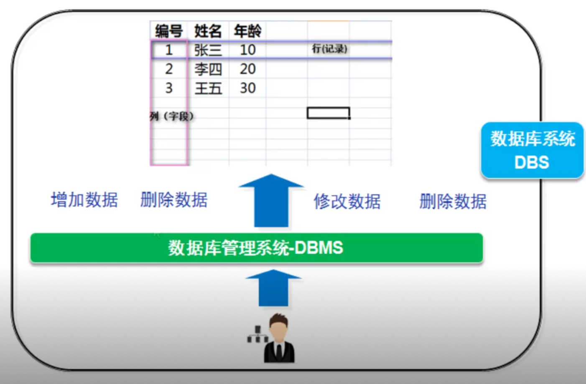
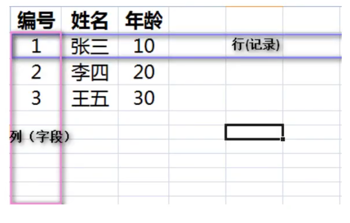

# 介绍

## 数据库能做什么？

- 存储大量数据，方便检索和访问。

- 保持数据信息一致，完整。

- 共享和安全。

- 通过组合分析，产生新的有用信息。

## 数据库基本概念

### 实体

只要是客观世界存在的、可以被描述出来的都是实体。

### 数据库(DB)

数据库就是数据仓库，可以存放结构化的数据。

### 数据库关系系统(DBMS)

是一种软件系统，提供操作数据库的环境，可以通过数据库管理系统对数据进行插入、删除、查询和删除操作。

### SQL
结构化查询语言，专门用来和数据库进行交流的语言，几乎所有的`DBMS`都支持`SQL`。

### SQL规范

1. SQL 语句不区分大小写，建议 SQL 关键字大写、表明和列表小写。

2. 命令用分号结尾。

3. 命令可以缩进和换行，一种类型的关键字放在一行。

4. 可以写单行和多行注释，`#`单行注释，`/***/`多行注释。

### 数据表

- 表是数据库中包含所有数据的数据库对象，也是其他对象的基础。

- 表定义是一列的集合，数据在表中是按照行和列的数据组织的，用来存放数据。

- 行也成为记录存放一个个实体，列称为字段用来描述实体的某一个属性。

## MySql